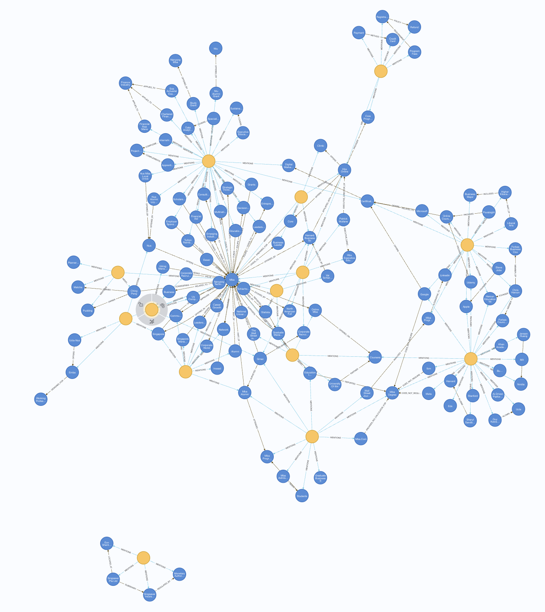
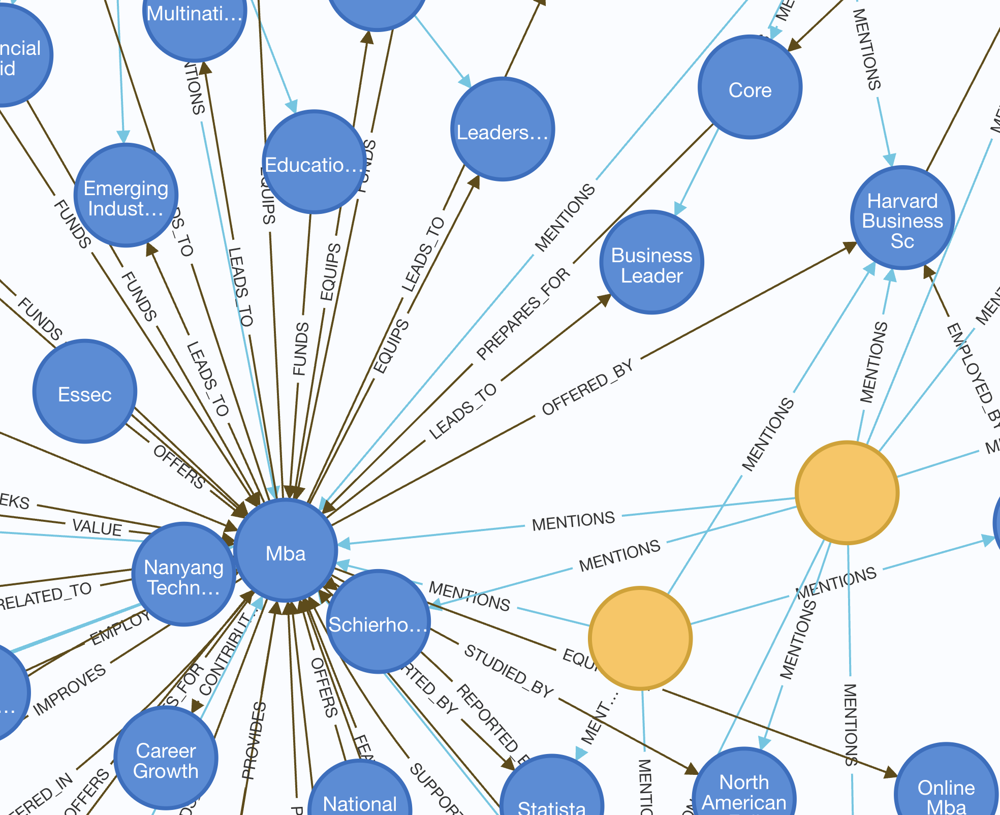

# shiny-engine

Ever think about experimenting with GraphRAG? This repository aims to be a simple guide to setup a GraphRAG application, and is a companion resource to an upcoming Medium publication.

<p align="center">
    
</p>

<p align="center">
    
</p>

The main code can be found in `main_notebook.ipynb` on the root folder.

## Setup
Using poetry
```
poetry install
```

Using UV
```
pip install uv
uv sync
```